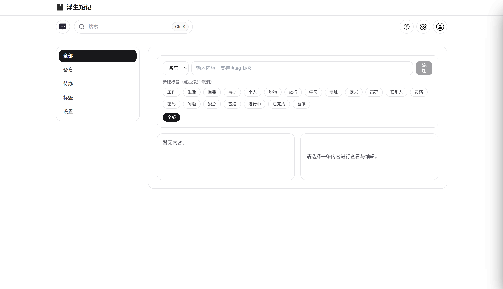
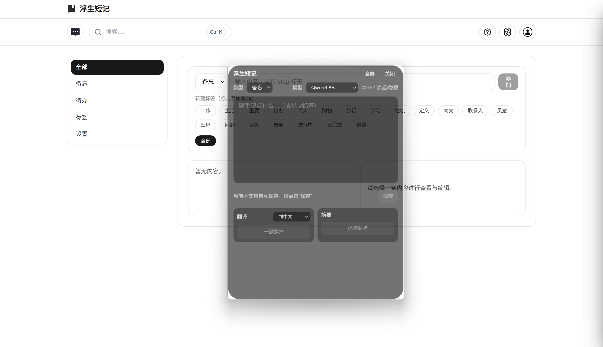
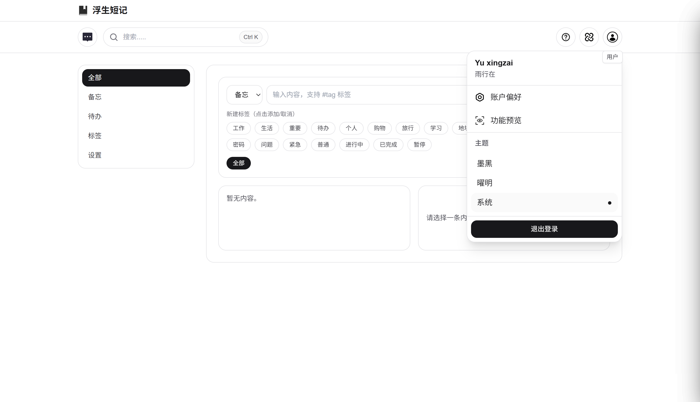
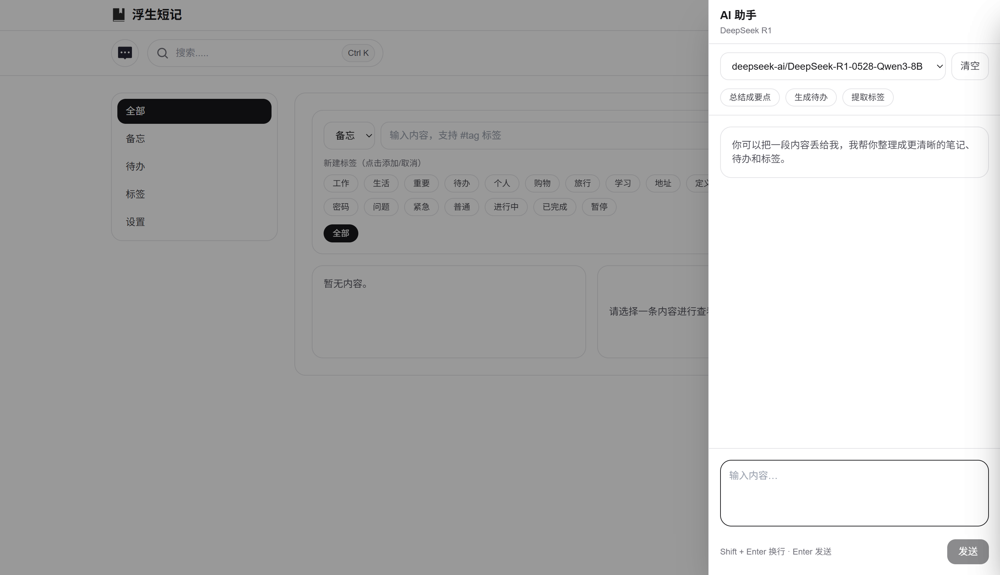
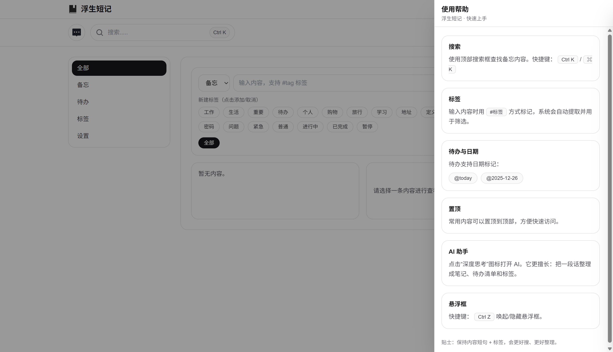
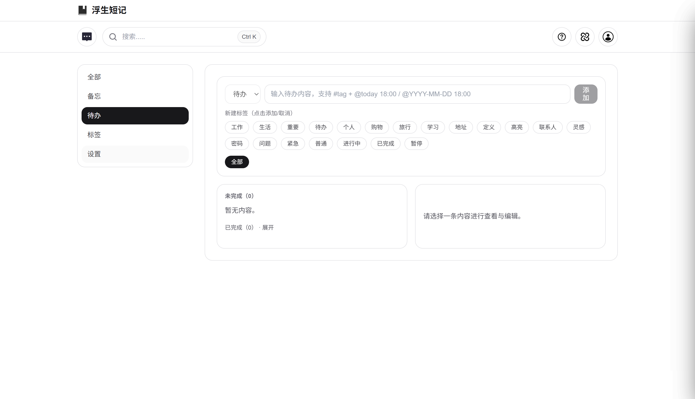
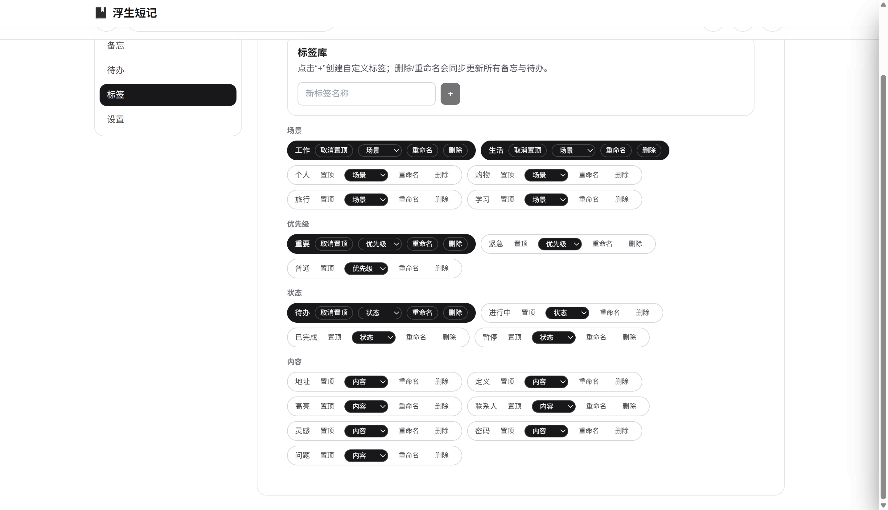
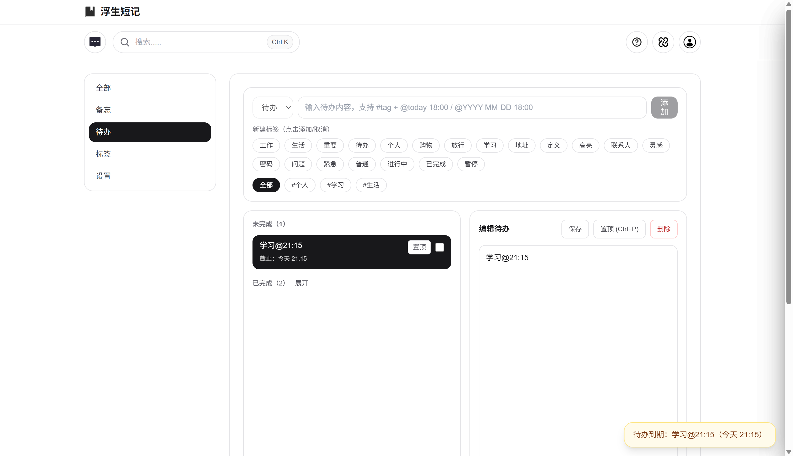

# Floating-Notes
浮生偷闲，落笔成记；轻量无冗，藏忆于桌。一款主打极简雅致、本地留存的桌面+悬浮备忘录，以轻盈姿态伴你记录灵感、待办琐事，不扰日常 workflow，让每一段细碎思绪皆有归处。

## 下载

Windows 安装包：

https://github.com/Qilin-a/Floating-Notes/releases

## 界面预览

点击缩略图可放大。

<table>
  <tr>
    <td>
      
    </td>
    <td>
      
    </td>
    <td>
      
    </td>
  </tr>
  <tr>
    <td>
      
    </td>
    <td>
      
    </td>
    <td>
      
    </td>
  </tr>
  <tr>
    <td>
      
    </td>
    <td>
      
    </td>
    <td></td>
  </tr>
</table>

